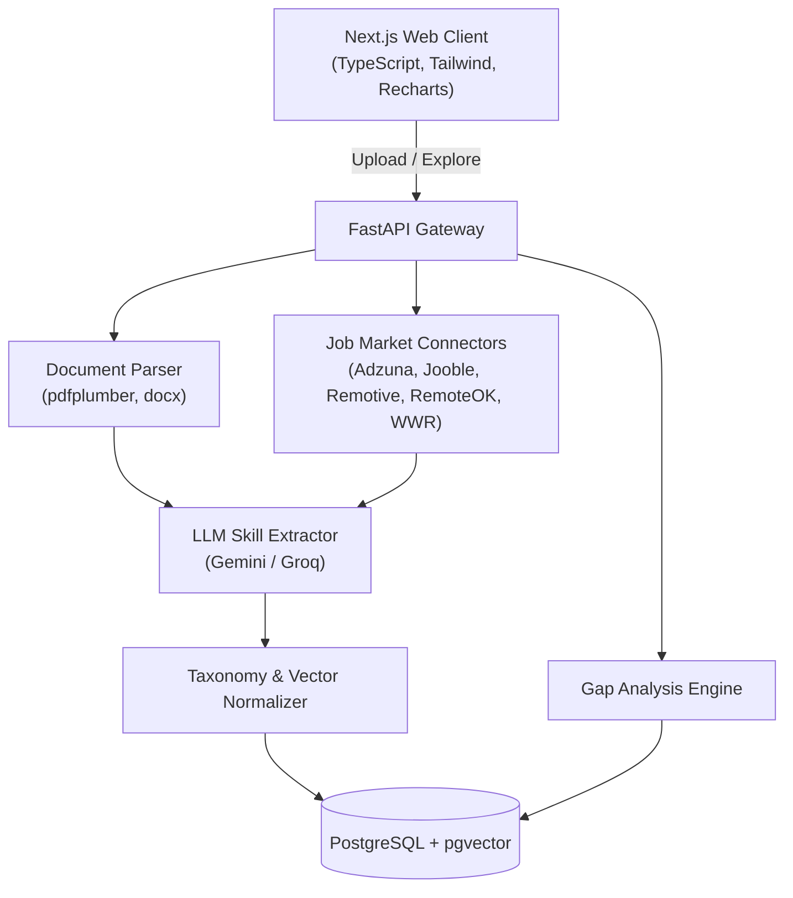

# Gapwright

*Automated Syllabus-to-Industry Gap Analyzer*

> **"Build the fix for the gap between syllabus and skills."**

We don't tell students which jobs to apply for. We tell universities which topics to teach, keep, or drop, using live job-market data.

---

## Overview

**Gapwright** is an end-to-end curriculum intelligence platform that helps academic institutions, educators, and policymakers align course curricula with evolving industry demands. 

Traditional curriculum audits are infrequent, manual, and subjective. Gapwright replaces this with continuous, data-driven intelligence:
1. **Academic Ingestion**: Parses university syllabi from PDF and DOCX files.
2. **Skill Extraction & Taxonomy**: Extracts discrete technical skills using LLMs (Google Gemini / Groq Llama 3) and normalizes them into a canonical taxonomy using semantic vector embeddings (`pgvector`).
3. **Live Market Ingestion**: Ingests job postings across multiple job data sources (Adzuna, Jooble, Remotive, RemoteOK, We Work Remotely) with polite domain rate limiting and daily budget guards.
4. **Curriculum Gap Analysis**: Calculates weighted demand coverage, identifies covered competencies, highlights critical missing skills, and flags obsolete topics to retire.
5. **Actionable Recommendations & Policy Insights**: Generates concrete curriculum revision recommendations, PDF/CSV exportable audits, and cross-institution policymaker analytics.

---

## Architecture



Detailed architecture diagrams and design choices are documented in [docs/architecture.md](docs/architecture.md).

---

## Tech Stack

| Layer | Technologies |
|---|---|
| **Backend** | FastAPI, Python 3.12, Pydantic v2, SQLAlchemy 2.0 (async), Alembic |
| **Database** | PostgreSQL 16 + `pgvector` (HNSW cosine similarity indexing) |
| **Intelligence** | Google Gemini API / Groq (Llama 3), Provider-agnostic embeddings |
| **Document Processing** | `pdfplumber`, `PyPDF2`, `python-docx` |
| **Market Connectors** | `httpx`, `feedparser`, Token-Bucket Rate Limiter |
| **Frontend** | Next.js (App Router), React 19, TypeScript (strict), Tailwind CSS, Recharts |
| **Testing** | `pytest`, `pytest-asyncio`, `respx`, `vitest`, React Testing Library |
| **Hosting (Free Tier)** | Render (Docker API), Vercel (Edge Web), Neon/Supabase (PostgreSQL) |

---

## Quickstart

### Prerequisites
- Python 3.12+
- Node.js 22+ & npm
- Docker and Docker Compose (for local PostgreSQL + pgvector)

### 1. Clone & Configure Environment

```bash
git clone https://github.com/sahilgaur22/Gapwright.git
cd Gapwright
cp .env.example .env
```

Edit `.env` to configure your database connection and preferred LLM provider (`GEMINI_API_KEY` or `GROQ_API_KEY`).

### 2. Start PostgreSQL with pgvector

```bash
docker compose up -d db
```

### 3. Initialize Backend

```bash
cd backend
python -m venv .venv
# On Windows:
.venv\Scripts\activate
# On Linux/macOS:
# source .venv/bin/activate

pip install -e ".[dev]"
alembic upgrade head
uvicorn app.main:app --reload --port 8000
```

Verify backend health at `http://localhost:8000/healthz`.

### 4. Initialize Frontend

```bash
cd ../frontend
npm install
npm run dev
```

Open `http://localhost:3000` to access the Gapwright web application.

---

## Testing & Quality Control

Both backend and frontend maintain strict linting, type safety, and automated test suites:

```bash
# Backend checks (from backend/)
ruff check .
ruff format --check .
mypy app
pytest

# Frontend checks (from frontend/)
npm run lint
npx tsc --noEmit
npm run test
npm run build
```

---

## Documentation

- [Architecture Guide](docs/architecture.md): System decomposition, data flow, and design principles.
- [REST API Reference](docs/api.md): Complete specifications for all API v1 endpoints.
- [Job Market Connectors](docs/sources.md): Source priorities, daily quotas, terms, and connector validation.
- [Deployment Runbook](docs/deployment.md): Production setup for Render, Vercel, Neon, and GitHub Actions CD.

---

## License

This project is licensed under the terms of the [MIT License](LICENSE).
