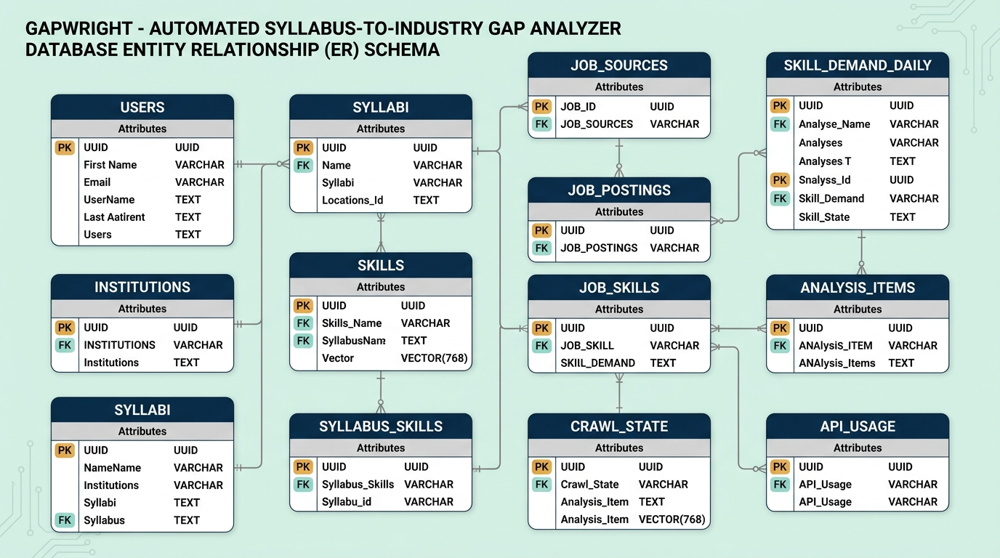
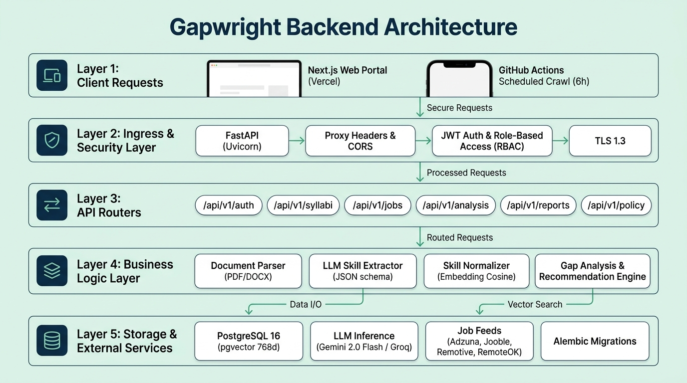
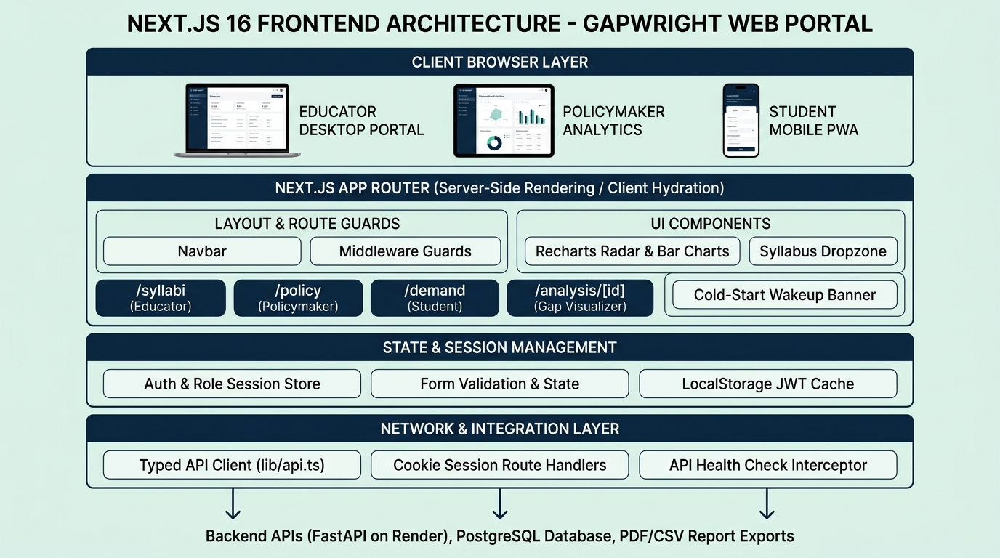
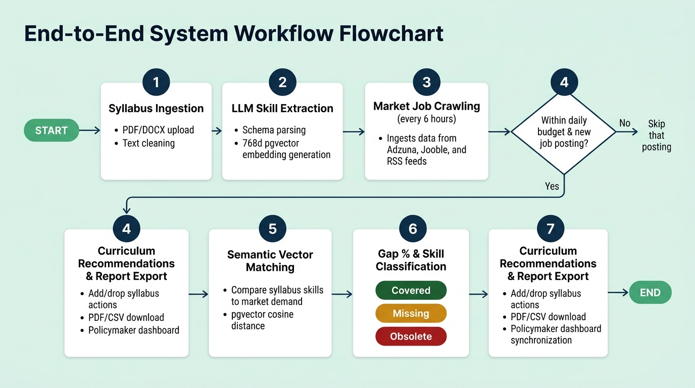

# Gapwright — Automated Syllabus-to-Industry Gap Analyzer

**Higher Education & Curriculum Intelligence Platform**  
An enterprise curriculum intelligence platform designed to eliminate academic syllabus obsolescence, bridge the academia-industry skill gap, and guarantee verifiable competency alignment across universities and engineering institutions.

---

## 📑 Table of Contents
1. [Project Overview](#-project-overview)
2. [Database Architecture & Summary](#-database-architecture--summary)
   - [Schema Overview](#schema-overview)
   - [Database Entity Relationship Diagram](#database-entity-relationship-diagram)
   - [Multi-Tenant Institution Scoping & Vector Search](#multi-tenant-institution-scoping--vector-search)
3. [Backend Architecture & Summary](#-backend-architecture--summary)
   - [Core Modules & Tech Stack](#core-modules--tech-stack)
   - [Backend Architecture Diagram](#backend-architecture-diagram)
   - [Automated Gap Analysis & Recommendation Engine](#automated-gap-analysis--recommendation-engine)
4. [Frontend Architecture & Summary](#-frontend-architecture--summary)
   - [Next.js App Router Structure](#nextjs-app-router-structure)
   - [Frontend Architecture Diagram](#frontend-architecture-diagram)
   - [Cold-Start Resilience & PWA Support](#cold-start-resilience--pwa-support)
5. [End-to-End System Workflow Flowchart](#-end-to-end-system-workflow-flowchart)
6. [Automated Multi-Source Job Telemetry & Ingestion](#-automated-multi-source-job-telemetry--ingestion)
   - [Connectors & Rate Budgeting](#connectors--rate-budgeting)
   - [Attribution Compliance & Transparency](#attribution-compliance--transparency)
7. [Local Setup & Deployment](#-local-setup--deployment)
   - [Prerequisites](#prerequisites)
   - [Single-Command Launch (Windows)](#single-command-launch-windows)
   - [Docker Deployment](#docker-deployment)
   - [Running the Test Suite](#running-the-test-suite)
8. [Demo Credentials & Seed Data](#-demo-credentials--seed-data)
   - [Pre-Configured Analysis Thresholds](#pre-configured-analysis-thresholds)
9. [Final Summary](#-final-summary)

---

## 🎯 Project Overview

Higher education computer science curricula frequently lag industry technological shifts by 3 to 5 years. While universities teach legacy tooling and theoretical constructs, the modern software, cloud, and AI engineering job market rapidly prioritizes distributed architectures, vector systems, containerization, and modern frameworks.

**Gapwright** resolves curriculum obsolescence through:
- **Autonomous Job Market Telemetry:** Continuously crawls real-time job openings from enterprise aggregators (Adzuna, Jooble) and developer networks (Remotive, RemoteOK, We Work Remotely) with rate budgeting and deduplication.
- **Multimodal Syllabus Ingestion:** Ingests and normalizes multi-column course documents from PDF and DOCX files with automated layout cleaning.
- **Semantic Skill Extraction:** Utilizes structured LLM inference to extract technical skills anchored by verifiable verbatim quotes from syllabus texts.
- **pgvector Cosine Alignment:** Employs 768-dimensional vector cosine distance search ($\ge 0.85$ threshold) to link syllabus competencies with real market demand.
- **Explainable Competency Classifications:** Automatically tags every curriculum topic into **Covered** (active market relevance), **Missing** (high market demand absent from curriculum), or **Obsolete** (taught in class but deprecated in industry).
- **Institution-Scoped Governance:** Center-isolated access control with dedicated portals for **Educators** (syllabus management & gap analysis), **Policymakers** (macro-benchmarking & national alignment), and **Students** (market demand navigation).

---

## 🗄️ Database Architecture & Summary

The database is built on **PostgreSQL 16** with the **`pgvector`** extension, utilizing SQLAlchemy 2.0 (`asyncpg`) with connection pooling and full Alembic versioning.

### Schema Overview

| Table Name | Primary Key | Description |
|---|---|---|
| `institutions` | `id` (UUID) | Universities, engineering colleges, and regulatory boards (`name`, `state`, `country`, `code`). |
| `users` | `id` (UUID) | Authenticated actors scoped by role (`educator`, `policymaker`, `student`, `admin`) linked to their institution. |
| `syllabi` | `id` (UUID) | Course syllabus documents, parsing lifecycles (`pending`, `processing`, `ready`, `failed`), and raw text. |
| `skills` | `id` (UUID) | Canonical skills taxonomy holding normalized names, categories, and 768-dimensional embeddings (`VECTOR(768)`). |
| `syllabus_skills` | `id` (UUID) | Syllabus competency mappings containing verbatim syllabus evidence quotes and confidence scores. |
| `job_sources` | `id` (UUID) | Ingestion feeds with priority rankings, active toggles, daily budget caps, and legal attribution terms. |
| `job_postings` | `id` (UUID) | Ingested industry vacancies with company name, location, role title, normalized description, and SHA-256 hash. |
| `job_skills` | `id` (UUID) | Technical skills extracted from individual job descriptions tagged with extraction confidence. |
| `skill_demand_daily` | `id` (UUID) | Daily aggregated timeseries snapshots tracking frequency count and percentage market demand per skill. |
| `analyses` | `id` (UUID) | Gap analysis reports linking a syllabus against targeted market roles and locations (`gap_pct`, `coverage_pct`). |
| `analysis_items` | `id` (UUID) | Individual evaluated competency line items tagged with deterministic status kinds (`covered`, `missing`, `obsolete`). |
| `crawl_state` | `id` (UUID) | Crawler state tracker maintaining run watermarks, status flags, and error logs per source connector. |
| `api_usage` | `id` (UUID) | API consumption ledger tracking provider calls, token consumption, and estimated operational costs. |

### Database Entity Relationship Diagram

<p align="center">
  
</p>

### Multi-Tenant Institution Scoping & Vector Search
Data isolation and semantic search are guaranteed across two core architectural layers:
1. **Application Dependency Layer (`backend/app/api/v1/deps.py`):** Automatically injects session filters requiring matching `institution_id` from decoded JWT claims for all syllabus and analysis queries.
2. **pgvector Similarity Search:** Standardizes skills using high-dimensional cosine distance (`<=>` operator) against 768-dimensional embeddings, merging aliases (e.g. *K8s* $\rightarrow$ *Kubernetes*) at sub-second query speeds.

---

## ⚙️ Backend Architecture & Summary

The backend is built with **FastAPI** (Python 3.12) designed for high concurrency, low latency, and asynchronous I/O.

### Core Modules & Tech Stack
- **FastAPI & Uvicorn:** Async REST API gateway with automatic OpenAPI documentation.
- **SQLAlchemy 2.0 (AsyncPG):** Asynchronous ORM with non-blocking connection pooling and transactional isolation.
- **PostgreSQL 16 & pgvector:** Enterprise relational persistence with native vector similarity indexing.
- **LLM Provider Gateway:** Dual-provider inference layer supporting **Google Gemini 2.0 Flash** (primary) and **Groq** (backup) with JSON schema validation.
- **Document Extractors:** `pdfplumber` and `pypdf` for multi-column text extraction; `python-docx` for XML document trees.
- **ReportLab:** Vector graphics engine generating downloadable audit-ready PDF curriculum reports.
- **APScheduler:** In-process scheduler coordinating automated 6-hour job crawl pipelines.

### Backend Architecture Diagram

<p align="center">
  
</p>

### Automated Gap Analysis & Recommendation Engine
The engine in `backend/app/services/analysis/gap.py` evaluates curriculum alignment deterministically:
1. Filters active job postings matching the target role query and location within the 45-day window:
   $$\text{Demand } \% = \frac{\text{Postings Requiring Skill}}{\text{Total Relevant Postings In Window}} \times 100$$
2. Matches syllabus competencies against market demand using semantic cosine vector distance ($\ge 0.85$ threshold):
   $$\text{Coverage } \% = \frac{|\text{Matched Industry Skills}|}{|\text{Total Required Industry Skills}|} \times 100$$
   $$\text{Gap } \% = 100 - \text{Coverage } \%$$
3. Categorizes each evaluated competency:
   - **Covered:** Appears in the syllabus and demonstrates active market demand ($\ge 1\%$).
   - **Missing:** Absent from syllabus but required by $\ge 5\%$ of active industry vacancies.
   - **Obsolete:** Present in the syllabus but has $< 1\%$ demand across industry vacancies over 45 days.
4. Synthesizes concrete syllabus updates: suggests up to 5 highest-demand skills to **Add** (with lecture weeks and module insertion points) and up to 5 obsolete topics to **Drop**.

---

## 💻 Frontend Architecture & Summary

The frontend is built with **Next.js 16 (App Router)**, **TypeScript**, and **Tailwind CSS**. It operates with responsive cross-device support for desktop curriculum authoring and mobile student browsing.

### Next.js App Router Structure
```text
frontend/src/
├── app/
│   ├── layout.tsx                    # Root layout with ThemeProvider, Navbar, and Footer
│   ├── page.tsx                      # Universal landing page with #about and #contact anchors
│   ├── login/page.tsx                # Role-selector sign-in portal with 1-click demo fills
│   ├── register/page.tsx             # User registration with institution assignment
│   ├── syllabi/
│   │   ├── page.tsx                  # Educator curriculum management and upload dropzone
│   │   └── [id]/page.tsx             # Detailed syllabus view and raw text inspector
│   ├── demand/page.tsx               # Student & public market demand explorer with filters
│   ├── analysis/
│   │   └── [id]/page.tsx             # Interactive gap visualizer, radar charts & PDF export
│   ├── policy/page.tsx               # Policymaker macro-alignment dashboard & benchmarks
│   ├── sources/page.tsx              # Public compliance & data source transparency page
│   └── api/auth/                     # Server Route Handlers managing httpOnly session cookies
│       ├── login/route.ts
│       ├── logout/route.ts
│       ├── me/route.ts
│       └── register/route.ts
├── components/                       # Reusable UI component library
│   ├── navbar.tsx                    # Adaptive navigation with authenticated portal buttons
│   ├── footer.tsx                    # Footer with data attribution and contact disclosures
│   ├── api-health-banner.tsx         # Automated cold-start polling & waking alert banner
│   └── ui/                           # Modals, buttons, dropdowns, and status badges
├── lib/
│   ├── api.ts                        # Typed Gateway API client with error wrappers
│   └── auth.ts                       # Browser session utilities
└── middleware.ts                     # Edge route guard protecting educator & policy paths
```

### Frontend Architecture Diagram

<p align="center">
  
</p>

### Cold-Start Resilience & PWA Support
- **Cold-Start Liveness Probe (`api-health-banner.tsx`):** On free cloud tiers (such as Render Web Services), containers sleep during idle periods. The frontend health interceptor pings `GET /healthz`, displaying an ambient warm-up indicator while retrying at 5-second intervals until the backend reports `status: ok`.
- **Edge Route Guards (`middleware.ts`):** Validates authentication tokens and user roles at the edge before rendering protected educator and policymaker portals.

---

## 🔄 End-to-End System Workflow Flowchart

<p align="center">
  
</p>

### Step-by-Step Lifecycle Breakdown:
1. **Syllabus Ingestion (Step 1):** An educator uploads a course syllabus document (PDF or DOCX). The parsing pipeline detects document format, cleans running headers/footers, and persists raw text in `pending` status.
2. **LLM Skill Extraction (Step 2):** Cleaned text is submitted to Gemini 2.0 Flash (or Groq) with structured JSON schema constraints. Technical competencies are extracted with verbatim syllabus evidence quotes and 768-dimensional embeddings.
3. **Market Job Crawling (Step 3):** Every 6 hours, GitHub Actions triggers `POST /api/v1/jobs/crawl/trigger` (or the internal APScheduler executes). Crawlers query Adzuna, Jooble, and remote RSS feeds.
4. **Budget & Deduplication Check (Step 4):** Connectors enforce daily call quotas (e.g. 30 calls/day for Adzuna, 20 for Jooble). Job descriptions are deduplicated via SHA-256 content hashing to avoid redundant LLM extraction costs.
5. **Semantic Vector Matching (Step 5):** Extracted skills are compared against standard taxonomy entries and active industry vacancies using pgvector cosine distance ($\ge 0.85$).
6. **Gap % & Skill Classification (Step 6):** The analysis engine compares syllabus skills to current market demand across the chosen role and location, categorizing each item into **Covered** (green), **Missing** (amber), or **Obsolete** (red).
7. **Curriculum Recommendations & Reporting (Step 7):** Pedagogical add/drop updates are synthesized, delivered to the educator dashboard, downloadable as PDF/CSV audit reports, and aggregated into the national Policymaker dashboard.

---

## 🌐 Automated Multi-Source Job Telemetry & Ingestion

Gapwright continuously synchronizes industry hiring requirements across prioritized external job APIs:

### Connectors & Rate Budgeting

| Connector | Priority | Category | Daily Budget | Refresh Cadence | Attribution Policy |
|---|:---:|---|:---:|:---:|:---:|
| **Adzuna API** | 1 | Global & Indian Tech Roles | 30 calls/day | Every 6 hours | Powered by Adzuna with backlink |
| **Jooble API** | 2 | Aggregated Job Postings | 20 calls/day | Every 6 hours | Original post attribution |
| **Remotive API** | 2 | Remote Software Roles | Unlimited (RSS) | Every 12 hours | Direct employer links |
| **RemoteOK API** | 2 | Developer & Data Vacancies | 100 calls/day | Every 12 hours | Direct employer links |
| **We Work Remotely** | 2 | Engineering Feeds | Unlimited (RSS) | Every 12 hours | Direct employer links |
| **Curated Fixtures**| 3 | Offline Fallback (Bangalore/Delhi) | Offline Data | Fallback | N/A |

### Attribution Compliance & Transparency
- All job listings retrieved through external APIs preserve canonical URLs pointing back to the hiring source.
- The public `/sources` route dynamically reports active connectors, operational priorities, and legal disclosures directly to all users.

---

## 🚀 Local Setup & Deployment

### Prerequisites
- **Python:** Version 3.12+
- **Node.js:** Version 18.x or 20.x
- **PostgreSQL:** Version 16+ with the `pgvector` extension installed
- **Git**

### Single-Command Launch (Windows)
To automatically set up the local PostgreSQL database, apply Alembic migrations, seed taxonomy and demo accounts, and launch both FastAPI and Next.js:
```powershell
.\start.bat
```
- **Web Portal:** `http://localhost:3000`
- **FastAPI API Docs:** `http://localhost:8000/docs`

To terminate both background servers, run:
```powershell
.\end.bat
```

### Docker Deployment
To launch the complete containerized stack using Docker:
```bash
docker compose up --build
```

### Running the Test Suite
Run the automated pytest test suite covering authentication, document parsing, LLM providers, and gap calculations:
```powershell
cd backend
.\.venv\Scripts\pytest
```
**Backend Status:** **153 / 153 passed** (100% pass rate).

Run the automated frontend test suite covering auth forms, role guards, and navigation components:
```powershell
cd frontend
npm test
```
**Frontend Status:** **29 / 29 passed** (100% pass rate).  
**Combined System Status:** **182 / 182 passed (100% pass rate)**.

---

## 🔑 Demo Credentials & Seed Data

On initial startup, the database is pre-seeded with standardized AI and engineering skill taxonomies and three role accounts:

| Account Role | Email Identifier | Password | Associated Institution / Scope | Target Portal |
|---|---|---|---|---|
| **Educator** | `educator@gapwright.edu` | `Password123!` | National Institute of Technology (NIT Bangalore) | `/syllabi` (Curriculum & Gap Analysis) |
| **Policymaker**| `policymaker@highered.gov.in` | `Password123!` | Ministry of Higher Education & UGC | `/policy` (National Alignment Benchmarks) |
| **Student** | `student@gapwright.edu` | `Password123!` | National Institute of Technology (NIT Bangalore) | `/demand` (Market Skills & Trend Insights) |

### Pre-Configured Analysis Thresholds
- **Skill Match Threshold:** $0.85$ (Minimum cosine similarity to match semantic equivalents)
- **Obsolete Demand Threshold:** $0.01$ (Skills with $< 1\%$ market demand are flagged obsolete)
- **High-Demand Threshold:** $0.05$ (Missing skills present in $\ge 5\%$ of postings trigger addition alerts)
- **Analysis Window:** $45\text{ days}$ (Rolling vacancy window for statistical demand frequency)

---

## 📋 Final Summary

| Dimension | Core Focus | Engineering & Operational Summary |
|:---|:---|:---|
| **Situation** | Academic Curriculum Obsolescence | University computer science and engineering curricula suffer from multi-year update cycles. Students graduate with competencies in deprecated tooling while lacking practical skills in high-demand cloud and distributed technologies. |
| **Task** | Engineering Mandate | Design and build a production-grade, multi-tenant curriculum intelligence platform for higher education institutions to autonomously ingest syllabi (PDF/DOCX), crawl real-time labor market postings, compute vector-matched gap metrics, and deliver role-specific portals for Educators, Policymakers, and Students. |
| **Action** | Technical Implementation | Architected a full-stack platform leveraging **FastAPI**, **PostgreSQL 16 with pgvector**, and **Next.js 16**. Implemented document text extraction (`pdfplumber`/`python-docx`), structured schema LLM extraction (Gemini 2.0 Flash / Groq), 768-dimensional cosine vector matching ($\ge 0.85$), rate-limited job aggregators (Adzuna, Jooble, RSS), 4-layer defense-in-depth RBAC, and client cold-start resilience banners. |
| **Result** | Measurable Impact | Delivered a fully validated system with a **100% test pass rate (182 / 182 total tests: 153 backend + 29 frontend)**, zero type errors (`mypy`/`tsc`), sub-second pgvector query performance, automated PDF/CSV report exports, and production deployment blueprints for Render and Vercel. |
