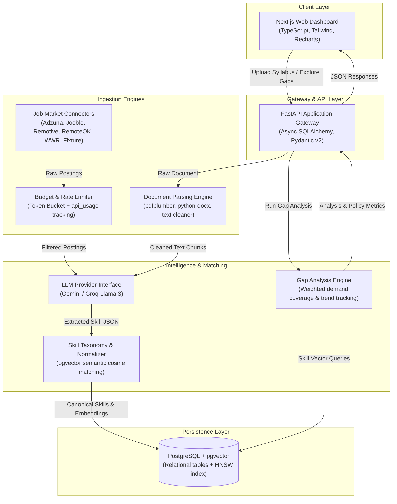

# Architecture: Gapwright

*Build the fix for the gap between syllabus and skills.*

---

## 1. System Overview

Gapwright is an automated syllabus-to-industry gap analyzer designed for academic curriculum designers, institutions, students, and education policymakers. The system continuously ingests real-time job market requirements, extracts and canonicalizes discrete skills using language models, parses university syllabi from PDF and DOCX documents, and computes actionable gap analyses indicating which topics to teach, maintain, or drop.

---

## 2. Core Subsystems

### 2.1 Web Dashboard (`frontend/`)
- **Framework**: Next.js App Router (React 19, TypeScript strict mode).
- **Styling**: Tailwind CSS with custom design tokens (`--color-primary`, `--color-accent`, `--color-surface`, `--color-text`, status tokens).
- **Visualizations**: Recharts for skill demand charts, gap breakdown gauges, and category comparison bars.
- **Client Features**:
  - Drag-and-drop syllabus uploader with real-time processing status polling.
  - Interactive market demand explorer with geographic and remote-role filtering.
  - Granular curriculum gap report showing covered, missing, and obsolete topics.
  - Policymaker cross-institution comparative dashboards and PDF/CSV export.
  - Cold-start banner providing visual feedback during cloud container spin-up.

### 2.2 Application Gateway (`backend/app/`)
- **Framework**: FastAPI with asynchronous route handlers and dependency injection.
- **Middleware**:
  - Strict CORS origin validation and regex matching.
  - `ProxyHeadersMiddleware` for trusted reverse proxy routing behind cloud providers.
  - Structured request-ID logging and execution timing.
  - In production (`ENV=production`), interactive API documentation endpoints (`/docs`, `/redoc`) are conditionally disabled.

### 2.3 Academic Document Parsing (`backend/app/services/parsing/`)
- Multi-format ingestion supporting PDF (`pdfplumber` with fallback to `PyPDF2`) and DOCX (`python-docx` for paragraphs and tabular content).
- Content-type MIME sniffing and file size constraints (maximum 10 MB).
- Document cleaner pipeline normalizing irregular whitespace, hyphens, non-ASCII characters, page headers, footers, and bullet formatting.

### 2.4 Skill Extraction and Canonical Taxonomy (`backend/app/services/skills/`)
- **Extraction**:
  - Section-aware text chunking with context overlap.
  - Structured JSON extraction through Pydantic schemas (`{name, category, evidence, confidence}`).
  - Dynamic fallback and repair parsing for LLM outputs.
- **Canonical Taxonomy**:
  - Seed taxonomy containing categorized technology, data science, engineering, and domain competencies.
  - Alias lookup dictionary resolving acronyms and synonyms (e.g., "K8s" -> "Kubernetes").
  - Semantic vector normalization: computes dense vector embeddings using `EMBED_MODEL` (`EMBED_DIM` dimensions). If cosine similarity exceeds `SKILL_MATCH_THRESHOLD` (default 0.85), occurrences are mapped to the existing canonical node; otherwise, a new canonical skill is registered.

### 2.5 Job Market Ingestion & Budgeting (`backend/app/services/sources/`)
- Pluggable connector registry supporting Priority 1 (Adzuna, Jooble), Priority 2 (Remotive, RemoteOK, We Work Remotely), and Priority 3 sources.
- Resilient offline fallback using `FixtureSource` for deterministic local development and continuous integration.
- Polite scraping controls:
  - Token-bucket domain rate limiter enforcing request intervals ($\ge 500\text{ ms}$ for RemoteOK, $\ge 250\text{ ms}$ for Remotive and WWR).
  - Daily per-source call caps tracked in `api_usage`. If a budget is exhausted, the crawler logs warnings and continues without failing the job.
  - Content-hash deduplication preventing redundant extraction of previously parsed postings.

### 2.6 Gap Analysis Engine (`backend/app/services/analysis/`)
- **Weighted Demand Formulation**:
  $$\text{coverage} = \frac{\sum_{s \in S_{\text{both}}} \text{demand\_pct}(s)}{\sum_{s \in S_{\text{market}}} \text{demand\_pct}(s)}$$
  $$\text{gap\_pct} = (1 - \text{coverage}) \times 100$$
- **Categorization**:
  - **Covered Skills**: Skills present in both the syllabus and job market requirements.
  - **Missing Skills**: In-demand market skills absent from the course curriculum.
  - **Obsolete Skills**: Syllabus topics whose market demand is below `OBSOLETE_DEMAND_THRESHOLD` (default < 1%).
  - **Emerging Skills**: High-velocity missing skills exhibiting positive demand growth over `ANALYSIS_WINDOW_DAYS` (calculated via `skill_demand_daily` snapshots).

---

## 3. Data Storage & Schema Design

PostgreSQL 16 with the `pgvector` extension provides unified relational and vector storage:
- `users`: User credentials, argon2 password hashes, roles (`admin`, `educator`, `student`, `policymaker`), and foreign keys to `institutions`.
- `institutions`: Academic organizations and their geographic locations.
- `syllabi`: Syllabus metadata, raw text, and processing status (`uploaded`, `processing`, `ready`, `failed`).
- `skills`: Canonical skill catalog, category taxonomy, alias arrays, and dense embedding vector column with an `HNSW` index (`vector_cosine_ops`).
- `syllabus_skills`: Many-to-many relationship linking syllabi to extracted skills with contextual evidence and confidence scores.
- `job_postings`: Ingested job postings with source, external ID, URL, description truncation flags, and publication dates.
- `job_sources`: Registry tracking source priority, daily budgets, attribution text, and external URLs.
- `skill_demand_daily`: Aggregated daily snapshots of skill frequencies across role queries and geographic locations.
- `analyses` & `analysis_items`: Materialized curriculum gap evaluations, coverage percentages, and categorized skill recommendations.
- `api_usage`: Per-source daily API request counters enforcing provider rate caps.

---

## 4. Deployment Topology

The system deploys across managed cloud free tiers:
- **API Runtime**: Render Web Service running a multi-stage Docker container (`python:3.12-slim`), non-root `appuser`, and Gunicorn with Uvicorn workers.
- **Web Frontend**: Vercel running Next.js static and serverless edge rendering.
- **Database**: Managed PostgreSQL on Neon or Supabase with `pgvector` enabled. Direct connection string (`DATABASE_URL_MIGRATE`) is utilized for Alembic migrations in CI, while connection-pooled URLs are used for application traffic.
- **Automation**: GitHub Actions workflows for continuous integration (`CI`), zero-downtime backend deployment (`deploy-backend.yml`), prebuilt frontend deployments (`deploy-frontend.yml`), and scheduled 6-hour job crawls (`crawl.yml`).
